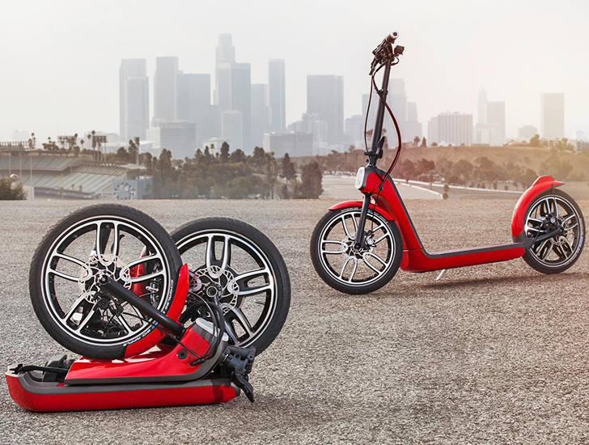
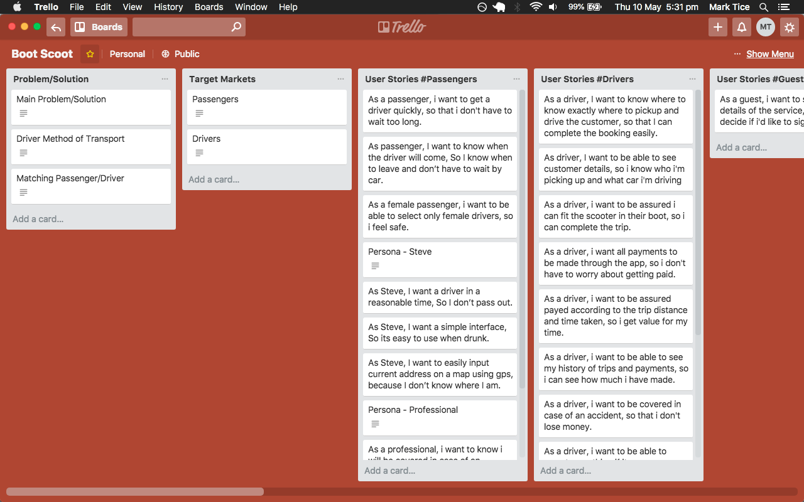
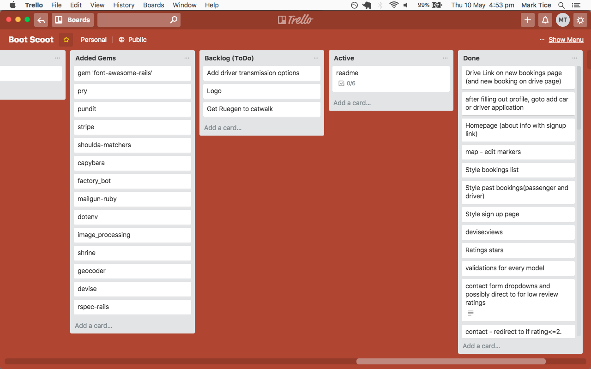

# Boot Scoot
https://bootscoot.herokuapp.com/

- [Concept](#concept)
  - [The Problem](#the-problem)
  - [Driver Transport](#driver-transport)
  - [Target Markets](#target-markets)
- [Planning](#planning)
  - [Trello](#trello)
  - [User Stories](#user-stories)
  - [User Journeys](#user-journeys)
  - [ERD](#erd)
  - [Wireframes](#wireframes)
- [Finished Product](#finished-product)
  - [Gems](#gems)
  - [APIs](#apis)
  - [Features](#features)

## Concept
### The Problem
You drive your car to an event, party, dinner and you have a few too many drinks. Now it's the end of the night you need to go home but you're in no state to drive. What are your options?

Uber or a taxi?

While these are much better options than driving they don't solve the problem of leaving your car behind.

**The Solution**

Boot Scoot solves this problem by pairing you with your own personal driver to get you AND your car home safely.

You hire your personal designated driver through our app to come to your location

They come to you quickly on a small form of transport (generally a foldable scooter) which fits in your car boot

They drive you and your car home safely
When the trip is complete, the driver retreives their transport from your boot and leaves to their next booking.

### Driver Transport
How does the driver get to you and then leave the drop-off location?

**Solution**: The driver will have a form of transport that fits in your boot. As long as it's below certain dimensions which fit into the car boot.

#### Transport Options:
The preference would be a high powered foldable scooter like pictured below. This type of scooter is powerful while still being able to fold down to a size that will fit in an everyday car boot. Although this is the preference we will allow other options aslong as they are closeby the pickup location.

- foldable scooter

Other Options
- foldable bike 
- electric skateboard
- hoverboard
- segway

### Target Markets
#### Passengers
Students/business workers/sick
Events: 
- sporting
- festivals
- concerts
- airports

#### Drivers
- Students
- People in-between jobs
- delivery drivers (uber eats, couriers etc)

---

## Planning
### Trello
[Trello Board - Boot Scoot](https://trello.com/b/g33pMsuZ/boot-scoot#)

My trello board is the main driver of my project management. It allowed me to plan ahead with User Stories, Models, Controllers, ERD and Wireframes. I also used it to determine the potential APIs that I am going to use as well as the gems that I need to build my rails project.

The trello board later turned into an Agile scrum board in which I managed my project to organise my Backlog, Active tasks, Tasks that are ready to be tested and the Tasks I already completed. Using Agile in this project is a very fruitful decision which leads to the proper timeboxing of my tasks.

### User Stories
My user stories are composed of 3 target markets: guests, passengers and drivers. Guests are the people who have not signed up for the app and are potential customers for the two-sided marketplace. Passengers and drivers are the registered users who can benefit from all the features of the site. Also, since it is a two-sided marketplace, a passenger can be a driver and a driver can be a passenger.

#### Guest
- As a guest, i want to see all the details of the service, so that i can decide if i'd like to sign up.

#### Passengers
Top level stories:
- As a passenger, i want to get a driver quickly, so that i don't have to wait too long.
- As passenger, I want to know when the driver will come, So I know when to leave and don’t have to wait by car.
- As a female passenger, i want to be able to select only female drivers, so i feel safe.

Passenger Persona: 
- Steve Stifler
  - 21 yrs old
  - Student, party animal
  - Driven car to a party with art students
  - Had waaaaaay to much to drink
  - Needs to get home but can’t drive and doesn’t want to leave car there

- As Steve, I want a driver in a reasonable time, So I don’t pass out.
- As Steve, I want a simple interface, So its easy to use when drunk.

Passenger Persona:
- Sally
  - 32 yrs old
  - Works in the city, 9-5 Mon-Fri
  - Had a few too many after work, wants to get home with his car so he can drive to work tomorrow

Sally's Stories
- As a professional, i want to know i will be covered in case of an accident, for peace of mind.
- As a professional, i want to know that i will have a safe registered driver, so that i can trust the service.

#### Drivers
- As a driver, I want to know where to know exactly where to pickup and drive the customer, so that I can complete the booking easily.
- As driver, I want to be able to see customer details, so i know who i'm picking up and what car i'm driving
- As a driver, i want to be assured i can fit the scooter in their boot, so i can complete the trip.
- As a driver, i want all payments to be made through the app, so i don't have to worry about getting paid.
- As a driver, i want to be assured payed according to the trip distance and time taken, so i get value for my time.
- As a driver, i want to be able to see my history of trips and payments, so i can see how much i have made.
- As a driver, i want to be covered in case of an accident, so that i don't lose money.
- As a driver, i want to be able to report something if it goes wrong, so that the problem can be attended to.

Driver Persona:
- Johnny
  - 20 yrs old
  - Broke
  - I need a job which is flexible around my classes and study schedule
  - I don’t own a car so can’t drive for uber

Johnny's Stories
- As Johnny, i want to be payed instantly, so that i can pay my bills(im broke).
- As Johnny, i want to be able to select max distance from my home, so that i'm not too far away since i only have a foldable bike.

### User Journeys

Drawing out user journeys helped to develope the flow and redirections of the site from sign-up to completing an entire booking.

### ERD
The ERD is one of the most critical parts of the design. Planning my tables ahead gave me an idea of what i want from my models and their relationships with one another. 

### Wireframes
[Figma - Boot Scoot](https://www.figma.com/file/V70gzh77WVl7rG0sr5S4MbVj/Boot-Scoot)

From the user stories a simply interface was required for the potentially inebriated passengers. I therefore went for a material type design, with simply use of color for ease of use. 

---

## Finished Product

https://bootscoot.herokuapp.com/

### Gems
The following gems were added:

- devise
  - to handle user authenication and sessions
- geocoder
  - for geocoding latitude/logitude
- shrine
  - image uploading
- image_processing
  - resizing images
- mailgun-ruby
  - mailer service
- stripe
  - secure payment system
- pundit
  - authorization
- dotenv-rails
  - secure environment variables
- font-awesome-rails
  - for awesome icons

Development/Testing
- rspec-rails
  - testing
- pry
  - debugging
- factory_bot_rails
  - model factories
- capybara
  - feature tests
- shoulda-matchers
  - easier cleaner testing

### APIs
I ended up using many different apis from the Google Maps Platform to achieve the results i wanted.

Google Maps Platform
- geocoding
  - for attaining latitude and logitude of a given address
- directions
  - for displaying the bookings path 
  - car directions
  - distance and estimated time
- places and autocomplete
  - for entering address fields
- geolocation
  - for finding driver location and displaying pickup locations nearby

### Features
- User authenication and authorization
- Image uploading and processing of different sized images
- Autocomplete of addresses

- Geocoding of addresses latitude and longitude
- Custom styled maps, made with a simplified minimal approach and color palette
- Map with origin and destination shown with a desired driving route

- Bookings available map for drivers, geolocating the driver and showing pickup locations nearby. 

- Trip directions panel for the driver
- Estimated time and calculated distance
- Calculted trip cost these values

- Order confirmation and credit card payments with stripe

- Reviews from both passenger and driver in relation to other user including a rating out of 5 and an optional comment

- Redirect to contact form if rating of < 3 stars
- Contact email form with list of all past bookings and reason for contact

- Each user have a rating shown to users for each role to motivate users to do a good job and be respectful to others 
- Past trips list for passenger bookings and or driver bookings

- and many more!